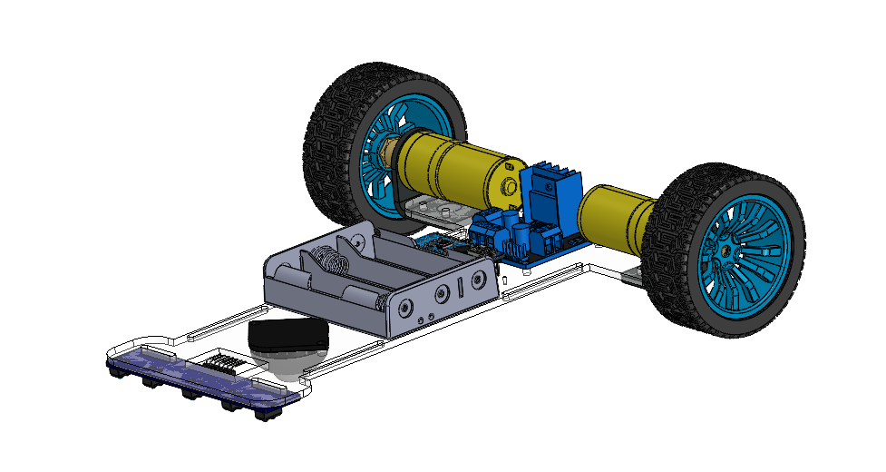
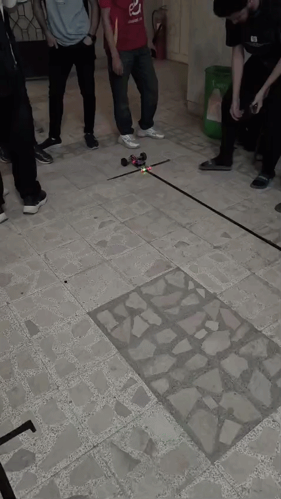

# Line-Follower-Robot-PID-Control

An autonomous high-speed Line Follower Robot developed as part of the **Mobile Robots (MAM331)** course at **Benha University - Faculty of Engineering**.

The robot was designed, assembled, programmed, and tested to follow a predefined path using a **5-sensor infrared array** and a **PID control algorithm** for accurate and stable navigation.

The project successfully participated in a line follower competition organized during the course, achieving one of the fastest completion times on the track.

---

## 📸 Robot Design



The robot chassis was designed and assembled using **SolidWorks**, focusing on lightweight construction, stability, and efficient sensor placement for optimal line tracking performance.

---

## 🎥 Demonstration



---

# 🚀 Project Features

- Autonomous line tracking
- PID-based steering correction
- High-speed navigation
- Real-time sensor processing
- Lost-line recovery mechanism
- Optimized turning behavior
- Motor calibration support
- Differential drive locomotion
- Custom mechanical design

---

# ⚙️ Hardware Components

| Component | Description |
|------------|------------|
| Arduino Uno | Main controller |
| L298N Motor Driver | Motor control |
| 2 DC Geared Motors | Robot locomotion |
| 5 IR Line Sensors | Line detection |
| Caster Wheel | Balance and support |
| Li-ion Battery Pack | Power supply |
| Custom Chassis | Mechanical structure |

---

# 🧠 Control Strategy

The robot uses a **PID (Proportional-Integral-Derivative) Controller** to continuously minimize the tracking error between the robot's position and the detected line.

### PID Controller Advantages

- Smooth movement
- Fast response
- Reduced oscillation
- Improved stability at high speed
- Better corner handling

The implemented controller combines:

- Proportional Term (P)
- Integral Term (I)
- Derivative Term (D)

to generate steering corrections in real time.

---

# 📡 Sensor Configuration

The robot uses five infrared sensors positioned at the front of the chassis.

```text
[S1] [S2] [S3] [S4] [S5]
```

### Error Mapping

| Sensor Position | Error |
|---------------|--------|
| Far Left | -2 |
| Left | -1 |
| Center | 0 |
| Right | +1 |
| Far Right | +2 |

This error value is used by the PID controller to calculate steering corrections.

---

# 🔧 Software Features

### Real-Time Sensor Reading

The robot continuously reads the state of all sensors to determine line position.

### PID Correction

Motor speeds are dynamically adjusted based on tracking error.

### Lost Line Recovery

If the line is temporarily lost, the robot automatically rotates toward the last known line direction until the path is detected again.

### Motor Calibration

Independent calibration values are included for left and right motors to compensate for hardware differences.

### High-Speed Optimization

The PID gains were experimentally tuned to achieve stable operation while maintaining high tracking speed.

---

# 🏎️ Competition Performance

The robot was tested during the Mobile Robots course competition.

### Achievements

- Successfully completed the course
- Stable tracking at high speed
- Accurate corner handling
- Fast recovery from tracking errors
- One of the fastest completion times during the competition

---

# 🛠️ Development Workflow

1. Mechanical Design using SolidWorks
2. Chassis Manufacturing and Assembly
3. Sensor Integration
4. Motor Driver Configuration
5. Arduino Programming
6. PID Tuning
7. Testing and Validation
8. Competition Deployment

---

# 📂 Repository Structure

```text
Line-Follower-Robot-PID-Control
│
├── README.md
│
├── Code
│   └── line_follower_pid.ino
│
├── CAD
│   └── Chassis_Design.png
│
├── Media
│   └── line_follower_demo.gif
│
├── Hardware
│   └── Components_List.md
│
└── Docs
    └── Competition_Result.png
```

---

# 💻 Technologies Used

- Arduino IDE
- Embedded C/C++
- PID Control
- SolidWorks
- Mobile Robotics
- Sensor-Based Navigation
- Differential Drive Systems

---

# 📚 Course

**Mobile Robots (MAM331)**

Faculty of Engineering  
Benha University

---

# 👨‍🏫 Supervision

**Dr. Muhammed Gaafar**

**Eng. Ahmed Adel Ghoneimy**

---

# 👥 Team Members

- Mahmoud Mohamed Shamekh
- Mohsen Hany Mohsen
- Youssef Ayad
- Barthinia Hany

---

# 🔗 GitHub Repository

Repository Link:

```text
(Add Repository URL Here)
```

---

# 📌 Keywords

Robotics • Mobile Robots • Arduino • PID Control • Line Follower • Embedded Systems • Control Systems • Automation • Mechatronics • SolidWorks • Engineering
